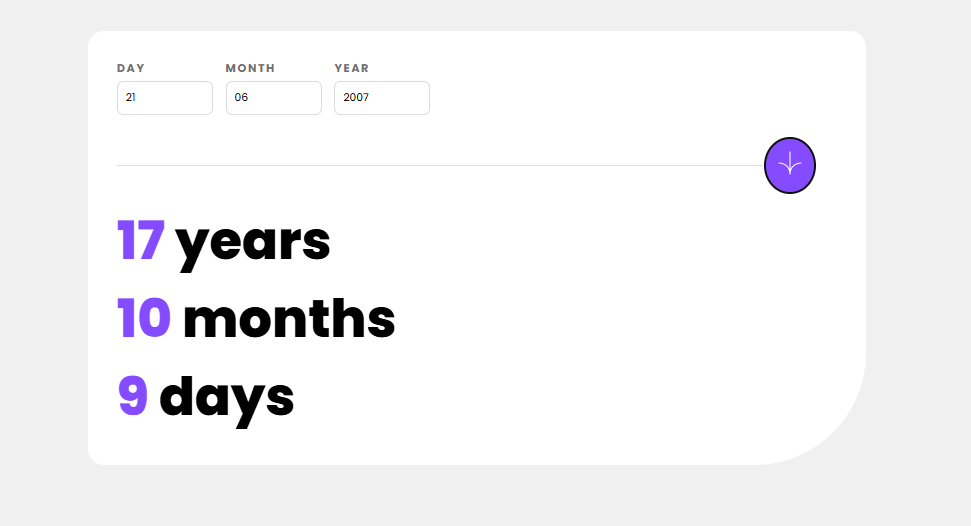

## 📅 Calculadora de Idade

🧮 A Calculadora de Idade é uma ferramenta simples que permite descobrir sua idade exata com base na data de nascimento informada. O cálculo é feito automaticamente, mostrando os anos completos de forma rápida e precisa.

## 🚀 Projeto

Este projeto foi desenvolvido com foco em praticidade e aprendizado. A ideia é oferecer uma forma direta de calcular a idade, enquanto aplica conceitos básicos de JavaScript, datas e interatividade com o usuário.

## 📺 Preview 

## 🛠️ Colaboração

* JavaScript - Lucas (Eu)

## ✍ Autora do HTML5 e CSS3 

Dev e professora - [Ana Luisa Santos](https://github.com/analuisadev)
